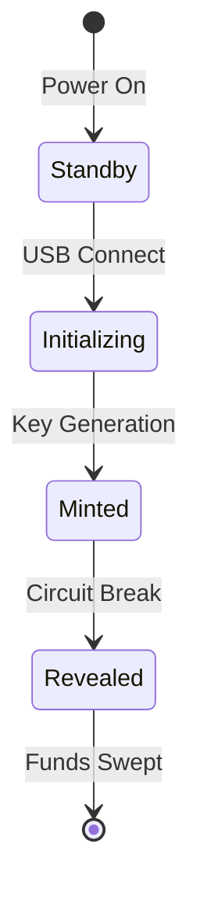

MINT: Physical Bitcoin Bearer Device
[]()
[]()
[]()

<div align="center">


*Making Bitcoin tangible*
</div>

🚀 Overview

Mint transforms Bitcoin into physical reality. Through innovative hardware design and sophisticated cryptography, Mint enables trustless, offline Bitcoin transactions. This isn't a concept or prototype - it's a working device that makes physical Bitcoin transfer possible today.

With PCB production underway and testing in progress, Mint represents a breakthrough in Bitcoin solutions.

💎 Core Implementation

Mint's elegant "break-to-reveal" mechanism makes Bitcoin tangible:
- **Battle-tested Security**: Multi-layer encryption with physical state verification
- **True Bearer Instrument**: As natural as handling cash, with cold storage security
- **Proven Hardware**: Custom PCB design with military-grade security components
- **Intuitive Interface**: Plug-and-play USB operation with clear visual feedback
- **Zero Trust Design**: Complete verification through physical properties

⚡ Production Status

Current Phase: PCB Production & Testing
- [x] PCB Design Completed & Verified
- [x] Initial Production Run Launched
- [x] Core Software Implementation Deployed
- [ ] Final Security Audit
- [ ] Mass Production Launch

<div align="center">


*Production PCB design with integrated security layers*
</div>

🛡️ Security Architecture

Physical Security Matrix
```
                    ┌─────────────────┐
                    │   Tamper-Proof  │
                    │  Circuit Design │
                    └────────┬────────┘
                             │
         ┌───────────────────┼───────────────────┐
         │                   │                   │
 ┌───────┴───────┐   ┌───────┴───────┐   ┌───────┴───────┐
 │    Circuit    │   │      OTP      │   │   Hardware    │
 │  Monitoring   │   │    Memory     │   │  Encryption   │
 └───────────────┘   └───────────────┘   └───────────────┘
```

State Machine


🎯 Technical Specifications

Hardware Architecture
- **Processor**: RP2040 dual-core ARM Cortex M0+
- **Security**: Custom-designed tamper-evident circuitry
- **Storage**: W25Q128JV Flash with OTP capabilities
- **Interface**: USB Mass Storage with FAT12
- **Indicators**: WS2812B RGB LED

Security Features
- Active tamper-detection mechanisms
- Hardware-based encryption
- One-time programmable memory verification
- Physical state authentication
- Cryptographic key protection

🌟 LED Status Matrix

| State | Color | Pattern | Meaning |
|-------|--------|---------|----------|
| Secure | 🔴 Red | Solid | Ready for Transfer |
| Initializing | 🔵 Blue | Pulsing | Setup in Progress |
| Generating | 🟡 Yellow | Spinning | Creating Wallet |
| Revealed | 🟢 Green | Solid | Funds Accessible |

🛠️ Development

Active Focus
- Security audit completion
- Production testing
- Documentation enhancement
- Manufacturing optimization

Build Requirements
- Arduino IDE with RP2040 support
- Specialized testing equipment
- Hardware verification tools

📁 Repository Structure

```
mint/
├── hardware/
│   ├── pcb-designs/
│   └── schematics/
├── firmware/
│   ├── core/
│   └── modules/
└── docs/
    ├── technical/
    └── user-guide/
```

🤝 Contributing

We welcome contributions from security researchers, hardware engineers, and bitcoiners.

⚠️ Security Note

Mint implements rigorous security standards. All implementations must follow our comprehensive security guidelines.

📜 License

MIT License - Freedom to innovate, obligation to attribute.

---

<div align="center">

**MINT: Bitcoin Made Tangible**

[Documentation](/) | [Security Audit](/) | [Contributing](/)
</div>
