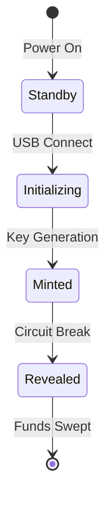

# MINT: The Future of Physical Bitcoin Transfer
[]()
[]()
[]()

<div align="center">


*The next evolution in physical Bitcoin transactions*
</div>

## 🚀 Overview

Mint revolutionizes the way we think about Bitcoin transfers. By bridging the digital and physical worlds, Mint creates a new paradigm for trustless, offline Bitcoin transactions. This isn't just another hardware wallet – it's a complete reimagining of how Bitcoin can be physically transferred, owned, and secured.

Currently in final testing phase with PCB production underway, Mint represents a breakthrough in physical cryptocurrency solutions.

## 💎 Core Innovation

Mint introduces an elegant "break-to-reveal" mechanism that makes Bitcoin tangible:
- **Bulletproof Security**: Multi-layer encryption with physical state verification
- **True Bearer Instrument**: As simple as handling cash, as secure as cold storage
- **Hardware Perfection**: Custom PCB design with military-grade security considerations
- **Seamless UX**: Plug-and-play USB interface with intuitive visual feedback
- **Zero Trust Required**: Complete verification through physical properties

## ⚡ Production Status

### Current Milestone: PCB Production & Testing
- [x] Completed PCB Design
- [x] Initial Production Run
- [x] Core Software Implementation
- [ ] Final Security Audit
- [ ] Mass Production Preparation

<div align="center">


*Production-ready PCB design with multi-layer security*
</div>

## 🛡️ Security Architecture

### Physical Security Matrix
```
                    ┌─────────────────┐
                    │   Tamper-Proof  │
                    │  Circuit Design │
                    └────────┬────────┘
                            │
        ┌───────────────────┼───────────────────┐
        │                   │                   │
┌───────┴───────┐  ┌───────┴───────┐  ┌───────┴───────┐
│    Circuit    │  │      OTP      │  │   Hardware    │
│  Monitoring   │  │    Memory     │  │  Encryption   │
└───────────────┘  └───────────────┘  └───────────────┘
```

### State Machine


## 🎯 Technical Specifications

### Hardware Architecture
- **Processor**: RP2040 dual-core ARM Cortex M0+
- **Security**: Custom-designed tamper-evident circuitry
- **Storage**: W25Q128JV Flash with OTP capabilities
- **Interface**: USB Mass Storage with FAT12
- **Indicators**: WS2812B RGB LED

### Security Features
- Multiple redundant tamper-detection mechanisms
- Hardware-based encryption
- One-time programmable memory verification
- Physical state authentication
- Cryptographic key protection

## 🌟 LED Status Matrix

| State | Color | Pattern | Meaning |
|-------|--------|---------|----------|
| Secure | 🔴 Red | Solid | Ready for Transfer |
| Initializing | 🔵 Blue | Pulsing | Setup in Progress |
| Generating | 🟡 Yellow | Spinning | Creating Wallet |
| Revealed | 🟢 Green | Solid | Funds Accessible |

## 🛠️ Development

### Current Focus
- Final security auditing
- Production testing
- Documentation refinement
- Manufacturing optimization

### Build Requirements
- Arduino IDE with RP2040 support
- Specialized testing equipment
- Hardware verification tools

## 📁 Repository Structure

```
mint/
├── hardware/
│   ├── pcb-designs/
│   └── schematics/
├── firmware/
│   ├── core/
│   └── modules/
└── docs/
    ├── technical/
    └── user-guide/
```

## 🤝 Contributing

Join us in revolutionizing physical Bitcoin transactions. We welcome contributions from security researchers, hardware engineers, and cryptocurrency experts.

## ⚠️ Security Note

While Mint is approaching production readiness, we maintain rigorous security standards. All implementations should follow our comprehensive security guidelines.

## 📜 License

MIT License - Freedom to innovate, obligation to attribute.

---

<div align="center">

**MINT: Making Bitcoin Tangible**

[Documentation](/) | [Security Audit](/) | [Contributing](/)
</div>
